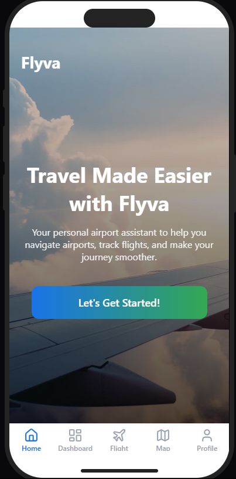
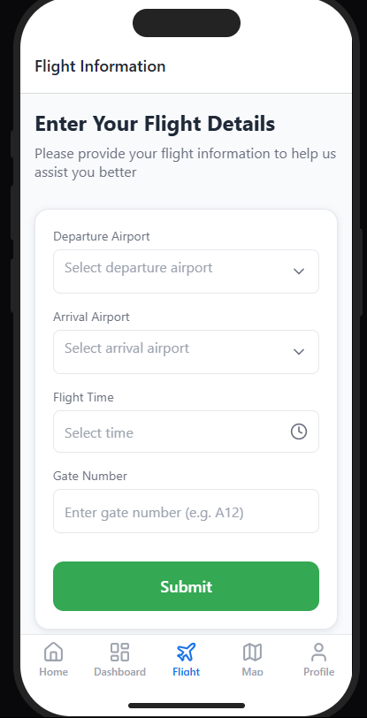
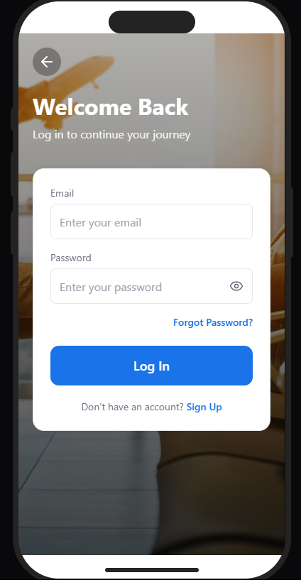
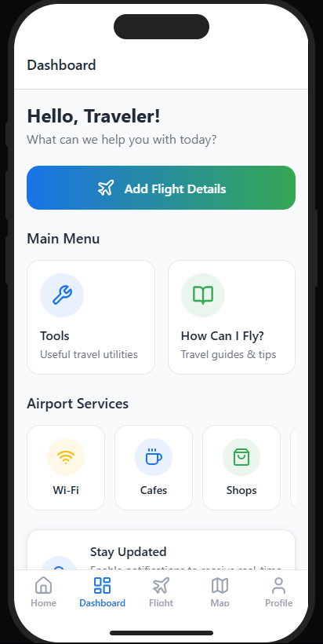

# ✈️ Flyva - Your Personal Airport Assistant

Flyva is a smart mobile application that guides users from their home to the airport and even inside the terminal using AR technology. Designed with accessibility and convenience in mind, Flyva helps travelers navigate transportation options, flight information, and indoor directions intuitively.

---

##  Features

-  Route Planning from Home to Airport with traffic data
-  AR Navigation inside the Airport
-  Flight & Gate Information Form
-  User Authentication (Sign Up & Login)
-  Tools and “How Can I Fly?” Guide for First-Time Travelers
-  Accessibility Features

---

## 🎨 App Screenshots

| Home Screen | Flight Form | Login | Dashboard                             |
|-------------|-------------|-------|---------------------------------------|
|  |  |  |  |


---

##  Getting Started

These instructions will get you a copy of the project up and running on your local machine.

### Prerequisites

- Android Studio (Giraffe or later)
- Kotlin & Jetpack Compose knowledge
- Android SDK 33+
- Emulator or physical Android device

### Installation

```bash
git clone https://github.com/your-username/flyva.git
cd flyva
